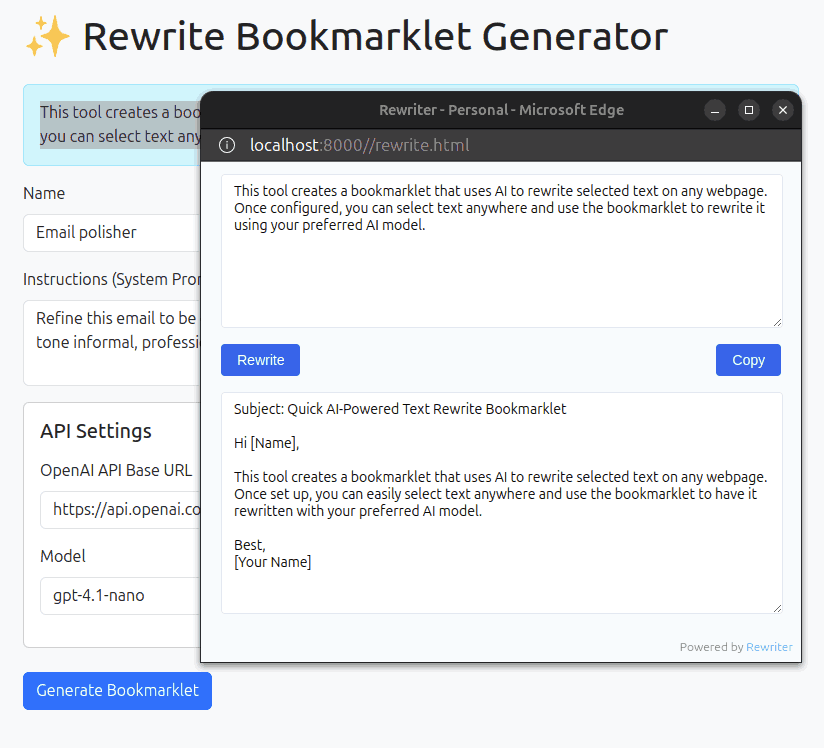

# Rewriter 📝

[](https://github.com/sanand0/rewriter/actions/workflows/deploy.yml)

Rewriter is a browser tool that uses AI to instantly rewrite selected text on any webpage. Create customized bookmarklets that transform your text using your preferred LLM APIs.



## Why Rewriter?

In today's fast-paced business environment, clear and effective communication is crucial. Rewriter helps you:

- **Polish Emails**: Transform rough drafts into professional, concise messages
- **Fix Documentation**: Improve technical documentation clarity and grammar instantly
- **Adapt Tone**: Switch between formal and casual writing styles based on your audience
- **Standardize Content**: Ensure consistent writing style across team communications
- **Enhance Clarity**: Make complex text more readable and accessible

## Real-World Use Cases

- **Customer Support**: Polish responses before sending to customers
- **Sales Teams**: Refine cold outreach emails for better engagement
- **HR Communications**: Ensure company-wide communications are clear and professional
- **Technical Writers**: Simplify complex technical content for broader audiences
- **Marketing Teams**: Adapt content tone across different channels
- **International Teams**: Standardize English writing across non-native speakers

## How to Use

1. Visit [Rewriter](https://sanand0.github.io/rewriter/)
2. Configure your bookmarklet:
   - Choose a name (e.g., "Email polisher")
   - Set your rewriting instructions
   - Add your LLM API credentials
3. Click "Generate Bookmarklet" and drag it to your bookmarks bar
4. On any webpage:
   - Select text you want to rewrite
   - Click your bookmarklet
   - Review and apply the rewritten text

## For Developers

### Setup

This is a static HTML application. To set it up locally:

```bash
# Clone the repository
git clone https://github.com/sanand0/rewriter.git
cd rewriter

# Install dependencies
npm install

# Build the bookmarklet
npm run build

# Serve the files using any static server, e.g.:
python3 -m http.server 8000
```

### Development

- The application uses vanilla JavaScript and Bootstrap for the UI
- The bookmarklet is minified using esbuild
- GitHub Actions automatically builds and deploys to GitHub Pages
- LLM prompts and development history are documented in [prompts/README.md](prompts/README.md)

## Links

- **Live App**: https://sanand0.github.io/rewriter/
- **Source Code**: https://github.com/sanand0/rewriter

## Author

S Anand ([@sanand0](https://github.com/sanand0)) <root.node@gmail.com>

## License

[MIT](LICENSE)
